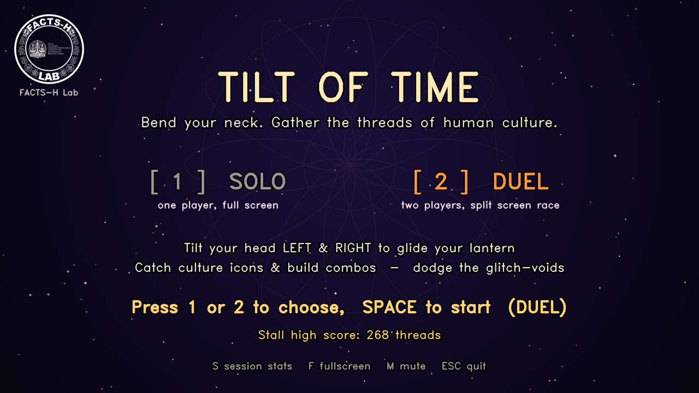
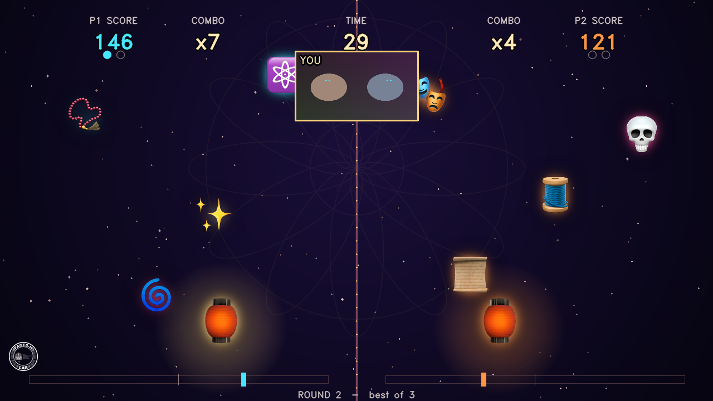
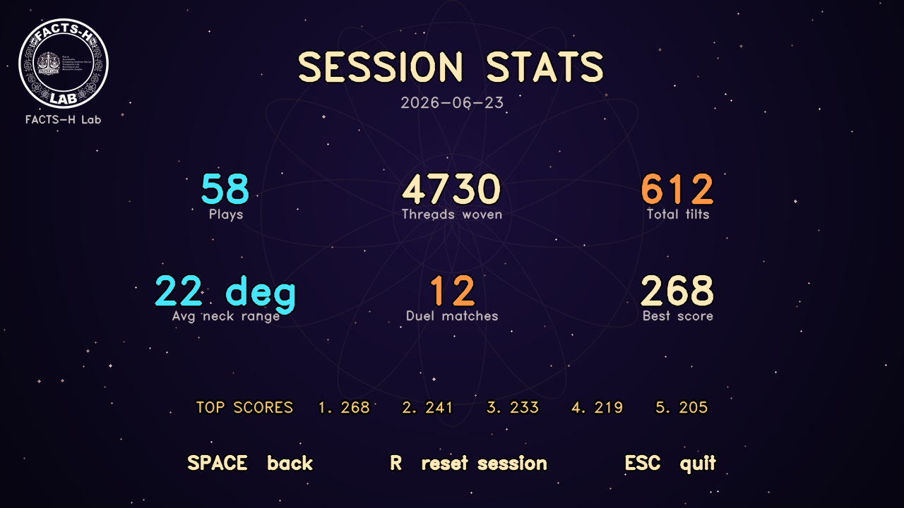

# 🏮 Tilt of Time

[](https://ebinrajiiit.github.io/Tilt_of_Time/)
[](LICENSE)


> **[▶ Play the live demo](https://ebinrajiiit.github.io/Tilt_of_Time/)** (browser edition — allow camera access).
> The browser edition now has **full feature parity** with the desktop app: solo & 2-player duel,
> best-of-3, countdown, Web-Audio sound + ambient pad, attract-mode demo, and session stats.
> The desktop app (below) is handy when you want a dedicated window with no browser chrome.

A **webcam neck-mobility game** for a culture × humanities × technology
conference stall — a **FACTS-H Lab** installation.

Tilt your head left and right (gentle lateral neck flexion — a real mobility
exercise) to glide a glowing lantern and **catch the falling icons of human
culture** — theatre, music, manuscripts, science, art, craft. Build combos,
dodge the glitch-voids, beat the stall high score. Each round is **60 seconds**,
so a queue of players keeps moving.

It uses your webcam with Google's **MediaPipe** face tracking and runs **fully
offline** — no internet, no browser, no servers.

## Screenshots

| Title | Duel (best-of-3) | Session stats |
|:---:|:---:|:---:|
|  |  |  |

---

## ▶ Run it (the desktop app — recommended)

A native window, reads the webcam directly. No browser involved.

```bash
cd neck_excer
./play.sh
```

The first run creates a local Python environment and installs the dependencies
(one time, ~1 minute). After that it launches instantly. To run it manually:

```bash
.venv/bin/python game_neck.py
```

**On first launch macOS will ask to let your Terminal use the camera — click
Allow.** (System Settings → Privacy & Security → Camera, if you need to enable
it later.)

### Controls
| Key | Action |
|-----|--------|
| **1** | Solo mode |
| **2** | Duel mode (2 players, split screen) |
| **SPACE / ENTER** | Start · Play again |
| **S** | Session stats screen (toggle) |
| **R** | Reset session stats (on the stats screen) |
| **F** | Toggle fullscreen |
| **M** | Mute |
| **ESC / Q** | Quit |

### 👥 Solo or Duel
- **Solo** — one player, full screen.
- **Duel** — two players stand side-by-side in front of the *same* webcam.
  The screen splits in two: the player on the **left** controls the left
  lantern (cyan), the player on the **right** controls the right lantern
  (orange). Each tilts their own head; the game tracks both faces at once and
  assigns each to its side automatically.

  **Best of 3:** each round is 60 seconds; the higher score wins the round.
  First player to win **2 rounds** wins the match. The match tally shows as
  pips under each score during play, and a between-rounds screen lets you press
  **SPACE** for the next round. A tied round is replayed without awarding a point.

  Great for a stall: two friends duel a best-of-3, a small crowd gathers, and
  *both* get the neck-mobility movement at the same time.

  (Match length is `WINS_NEEDED` near the top of `game_neck.py` — set to `2` for
  best-of-3, `3` for best-of-5.)

---

## 🎮 How to play
1. Press **SPACE** → a 2-second calibration captures your upright posture,
   then a **3 · 2 · 1 · GO!** countdown with a rising beep on each digit and a
   bright tone on GO (tilt your head during it to test your lantern — the timer
   only starts on GO). Press **M** to mute.
2. **Tilt your head** ear-toward-shoulder to move the lantern left/right.
3. **Catch** 🪔🎭📜🎶🏛️🔭🎨 culture icons. Chain catches for a rising **combo**
   — each catch plays a pluck that climbs in pitch as your combo grows.
4. **✨ sparks** are rare bonus points (sparkle chime). **🌀💀🕳️ glitch-voids**
   scramble your combo (buzzy thunk) — dodge them. Press **M** to mute all audio.

A soft **ambient pad** plays gently under each round (a seamless drone loop) and
fades out between rounds, so the stall has a calm, installation-like atmosphere.
5. After 60s you get your **score, neck range (°), best combo, and full-tilt count**.

The on-screen **tilt meter** and **neck range** stat quietly turn the exercise
into the scoreboard — players naturally reach their full comfortable range.

---

## Attract mode (auto-demo)
When the title screen sits idle with no face for ~6 seconds, the game starts a
**self-running AI demo** — a lantern auto-catches icons while "STEP UP — PRESS
SPACE TO PLAY" pulses on screen. The moment someone steps in front of the camera
(a face is detected) it snaps back to the title, ready to play. Great for
drawing a crowd between players. The demo is silent so the stall isn't noisy.

## Session stats (end-of-day)
Press **S** (from the title or any results screen) to see the day's totals:
**plays, threads woven, total tilts, average neck range, duel matches, best
score, and the top-5 scores**. The numbers accumulate across the whole session
and are saved to `.tot_session.json`, so they survive an app restart and
**auto-reset when the calendar date changes** (a fresh tally each day). Press
**R** on the stats screen to reset manually. A nice number to read out at the
end of the day: total tilts = how much collective neck mobility the stall did. 🧘

## Stall tips
- Press **F** for fullscreen so it looks like an installation.
- Even, front lighting on the player's face = rock-solid tracking.
- Sit/stand ~50–80 cm from the camera. Calibration adapts to each player.
- The little **"YOU"** panel (bottom-right) shows the live face mesh — part of the wow.
- If a player's left/right feels reversed, set `TILT_SIGN = -1` near the top of `game_neck.py`.

---

## 🛠 Customising (`game_neck.py`, top of file)
- `GOOD` — the collectible emoji + names (swap in motifs for your theme).
- `RARE`, `BAD`, `LANTERN` — bonus, hazard, and player icons.
- `ROUND_SECONDS` — round length (default 60).
- `FULL_TILT_DEG` — how far to tilt to reach the edge (default 20°; lower = easier).
- `SMOOTH` — tilt responsiveness.

---

## Troubleshooting
- **"could not open the webcam"** → another app (Zoom / Teams / FaceTime / Photo
  Booth / a browser tab) is holding the camera. Quit it. If still stuck:
  `sudo killall VDCAssistant AppleCameraAssistant`, or reboot.
- **Tracking not finding your face** → improve lighting; face the camera; move closer.
- It falls back to OpenCV eye-tracking automatically if MediaPipe is unavailable.

---

## What's in the folder
- `game_neck.py` — the desktop game (this is the app you want)
- `play.sh` — one-command launcher (sets up the venv on first run)
- `requirements.txt` — Python dependencies
- `vendor/face_landmarker.task` — the offline face model
- `index.html` / `style.css` / `game.js` — the **browser edition** (full parity; hosted as the live demo)
- `serve.py` / `start.sh` — optional local server for running the browser edition offline

---

## ⚕️ A note on the "exercise"
This is light, playful **mobility** movement, not physiotherapy. It encourages
slow, comfortable lateral neck tilts. Players should move gently, stop if
anything hurts, and never force range. 🌱

## Requirements
- macOS / Linux / Windows with a webcam and Python 3.9–3.13.
- Internet **only** for the one-time dependency install; the game itself runs offline.

## Credits & license
Built as a **FACTS-H Lab** installation for a culture × humanities × technology
conference. Face tracking by Google [MediaPipe](https://ai.google.dev/edge/mediapipe);
graphics via OpenCV; all sound synthesized at runtime (no audio files).

Released under the [MIT License](LICENSE).
